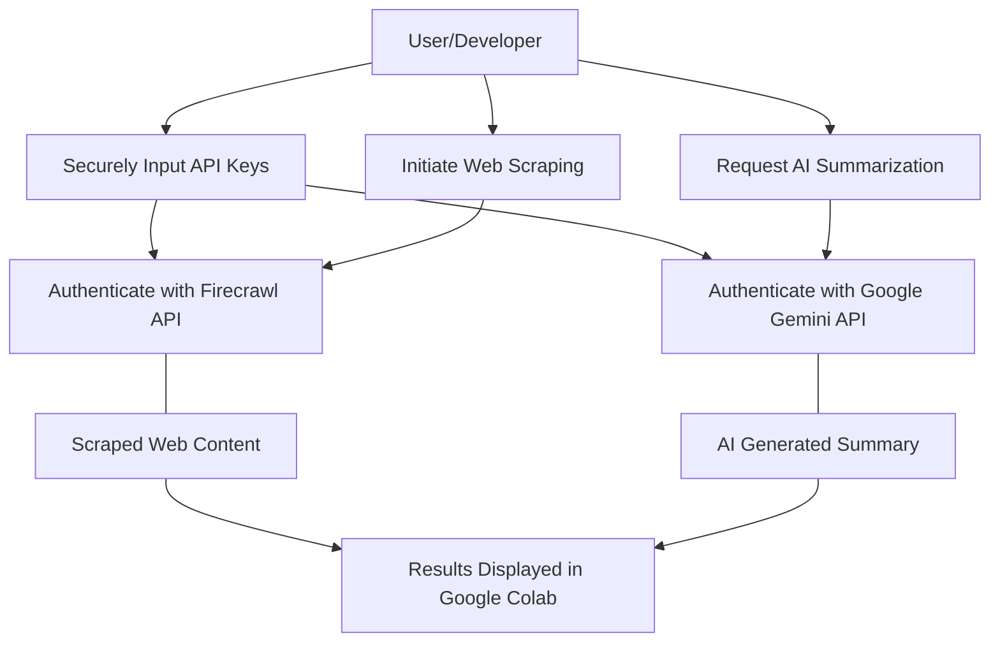
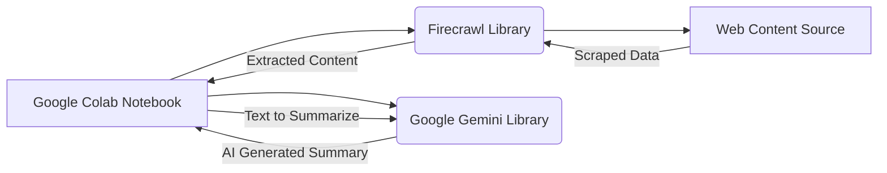

# Automated Web Scraping & Summarization with Firecrawl & Gemini

**Meta Description:** Learn how to automate web content extraction and summarization with Firecrawl and Google Gemini in Google Colab, combining secure API key handling, web scraping, and AI-powered text generation.

---

## Table of Contents
- [Introduction](#introduction)
- [Prerequisites](#prerequisites)
- [Step 1: Library Installation](#step-1-library-installation)
- [Step 2: Secure API Key Configuration](#step-2-secure-api-key-configuration)
- [Step 3: Web Scraping with Firecrawl](#step-3-web-scraping-with-firecrawl)
- [Step 4: AI Summarization Using Google Gemini](#step-4-ai-summarization-using-google-gemini)
  - [API Configuration](#api-configuration)
  - [Listing Available Models](#listing-available-models)
  - [Generating Summary](#generating-summary)
- [Diagrams](#diagrams)
  - [Use Case Diagram](#use-case-diagram-for-automated-web-scraping--summarization)
  - [System Architecture Diagram](#system-architecture-diagram-for-automated-web-scraping--summarization)
- [Troubleshooting Tips](#troubleshooting-tips)
- [Conclusion](#conclusion)
- [FAQ](#faq)

---

## Introduction

In today’s digital age, the exponential growth of web content makes it a challenge to extract and summarize relevant information efficiently. This tutorial demonstrates an end-to-end automated workflow using the Firecrawl web scraping library and Google Gemini’s AI summarization capabilities in Google Colab. Whether you’re automating research, aggregating insights, or developing AI-driven applications, this guide walks you through integrating these powerful tools securely and effectively.

---

## Prerequisites

Before you begin, ensure you have the following:

- A Google Colab environment set up
- Python installed
- API keys for Firecrawl and Google Gemini
- Basic familiarity with Python programming and web scraping concepts

---

## Step 1: Library Installation

First, install the required libraries. Run the following command in your Google Colab cell to install both the `google-generativeai` and `firecrawl-py` packages:

```python
!pip install google-generativeai firecrawl-py  # Install necessary libraries for AI summarization and web scraping
```

This command ensures that your environment is equipped to perform both AI-powered text summarization and structured web scraping seamlessly.

---

## Step 2: Secure API Key Configuration

For security, we use the `getpass` module to input your API keys so that they aren’t displayed. This ensures your keys remain confidential throughout the session.

**Firecrawl API Key Configuration:**

```python
import os
from getpass import getpass

# Prompt for the Firecrawl API key securely
os.environ['FIRECRAWL_API_KEY'] = getpass('Enter your Firecrawl API key: ')
```

This snippet captures the Firecrawl API key securely and stores it in an environment variable, which will be used later by Firecrawl functions for authentication.

---

## Step 3: Web Scraping with Firecrawl

With the API key configured, initialize the Firecrawl app and scrape content from a target URL. In this example, we extract the Markdown version of the Python programming language page on Wikipedia.

```python
from firecrawl import FirecrawlApp

# Initialize the Firecrawl app with the stored API key
firecrawl_app = FirecrawlApp(api_key=os.environ['FIRECRAWL_API_KEY'])

# Define the target URL for web scraping
target_url = 'https://en.wikipedia.org/wiki/Python_(programming_language)'

# Scrape the content of the target URL
result = firecrawl_app.scrape_url(target_url)

# Extract the content in Markdown format
page_content = result.get('markdown', '')

# Output the length of the scraped content as a verification step
print('Scraped content length:', len(page_content))
```

This code snippet initializes the Firecrawl application, fetches content from the target URL, extracts it in Markdown format, and confirms the operation by printing the content length.

---

## Step 4: AI Summarization Using Google Gemini

The next step is to generate a concise summary of the scraped content using Google Gemini.

### API Configuration

Configure the Google Gemini API by securely inputting your API key and initializing the API client. This step is critical for accessing powerful AI models for text summarization.

```python
import google.generativeai as genai
from getpass import getpass

# Securely prompt for the Google Gemini API key
GEMINI_API_KEY = getpass('Enter your Google Gemini API Key: ')

# Configure the Gemini API client with the provided key
genai.configure(api_key=GEMINI_API_KEY)
```

### Listing Available Models

Before generating a summary, it’s useful to list the available Gemini models to confirm API access and determine which model best suits your needs:

```python
# List available Gemini models to verify API access
for model in genai.list_models():
    print(model.name)
```

### Generating Summary

Generate a summary by passing a truncated version of the scraped content (up to 4000 characters) to the Gemini model:

```python
# Initialize the Gemini 1.5 Pro model for summarization
model = genai.GenerativeModel('gemini-1.5-pro')

# Generate a summary from the first 4000 characters of the scraped content
response = model.generate_content(f"Summarize this:\n\n{page_content[:4000]}")

# Print the generated summary
print('Summary:\n', response.text)
```

This step initializes the Gemini model, sends a prompt containing the scraped content, and prints the concise summary produced by the AI.

---

## Diagrams

### Use Case Diagram for Automated Web Scraping & Summarization

Below is a diagram illustrating the key interactions in the workflow. The diagram shows how the user securely inputs API keys for both Firecrawl and Google Gemini, initiates web scraping, and triggers AI-based summarization, resulting in output displayed in Google Colab.



### System Architecture Diagram for Automated Web Scraping & Summarization

This diagram maps out the core components of the workflow. The Google Colab Notebook serves as the central hub, interacting with the Firecrawl library for data extraction and the Google Gemini library for generating summaries.



---

## Troubleshooting Tips

If you encounter issues during setup or execution, consider the following troubleshooting steps:

- **API Key Errors:** Ensure that your API keys are correctly input using `getpass` and that they have not expired. Double-check that they are stored in the appropriate environment variables.
- **Library Installation:** Verify that both `google-generativeai` and `firecrawl-py` are installed successfully with no errors in Google Colab.
- **Code Execution:** Ensure that each code cell runs sequentially without skipping any steps. If a step fails, re-run previous cells to confirm successful API configuration.
- **Model Limitations:** Remember, the input to the Gemini model is limited to 4,000 characters. If you are processing a larger body of text, consider truncating or pre-processing the content.
- **Further Help:** Consult the official documentation for [Firecrawl](https://firecrawl.example.com/docs) and [Google Gemini](https://developers.google.com/gemini/) for additional troubleshooting and advanced configurations.

---

## Conclusion

By combining Firecrawl with Google Gemini, this tutorial has demonstrated how to build an automated pipeline that both scrapes web content and produces AI-generated summaries. This integration is ideal for automating data extraction, streamlining research, and powering a range of natural language processing (NLP) applications.

Experiment with different models and configurations, and consider exploring advanced use cases such as integrating alternative AI models or expanding to multi-source data extraction.

For additional learning and support, consult the official documentation and community forums associated with these tools.

---

## FAQ

> **Q:** How does Firecrawl integrate with Google Gemini for text summarization?  
> **A:** Firecrawl extracts structured content from web pages, and the content is then sent to Google Gemini which processes and returns a concise summary.

> **Q:** What are the steps to securely handle API keys in Google Colab?  
> **A:** By using Python’s `getpass` module, API keys are input securely (hidden during entry) and stored as environment variables to prevent exposure during the session.

> **Q:** Can this tutorial be adapted for other AI models?  
> **A:** Yes, the pipeline is flexible. You can replace the Gemini model with other AI models by updating the API configurations accordingly.

---

*
