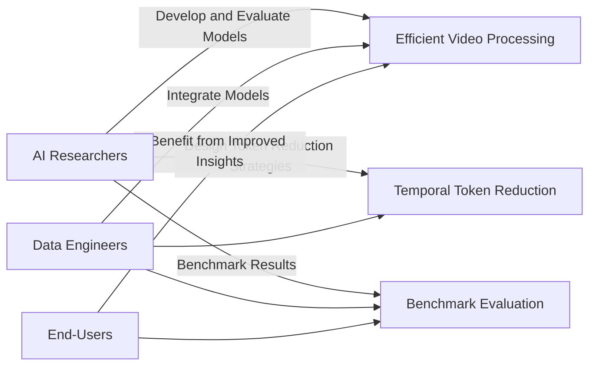

# STORM: Efficient Video Understanding with Token Reduction

<!-- Meta Description: Discover how STORM uses spatiotemporal token reduction to enhance long-video AI processing, boosting efficiency and accuracy. -->

## Table of Contents
1. [Introduction](#introduction)
2. [Challenges in Video Processing](#challenges-in-video-processing)
3. [Introducing the STORM Model](#introducing-the-storm-model)
4. [Model Architecture and Technical Details](#model-architecture-and-technical-details)
    - [Pseudo-code for Token Reduction](#pseudo-code-for-token-reduction)
5. [Experimental Evaluation and Results](#experimental-evaluation-and-results)
6. [Conclusion](#conclusion)
7. [Diagrams](#diagrams)
    - [Use Case Diagram for Efficient Video Processing](#use-case-diagram-for-efficient-video-processing)
    - [System Architecture Diagram for STORM Model](#system-architecture-diagram-for-storm-model)

---

## Introduction

In today’s fast-paced world of video AI, understanding dynamic video content is more crucial than ever. Traditional video-language models often struggle with continuous flow and temporal coherence, frequently missing critical motion details. This article introduces the innovative STORM model, which leverages spatiotemporal token reduction to address these challenges head-on. By integrating temporal information within the video token level, STORM achieves efficient long-video processing while significantly reducing computational overhead.

---

## Challenges in Video Processing

Videos are not merely a collection of static images; they embody motion, context, and continuity. However, several challenges persist with conventional approaches:

- **Loss of Motion Details:** Static frame-based analysis misses important temporal interactions.
- **High Computational Costs:** Processing long videos demands significant resources due to redundant overlapping data.
- **Inefficient Data Compression:** Overlapping frames often lead to redundant computations without effective token reduction.

The diagram below illustrates these challenges, emphasizing the difficulties encountered in continuous video processing and the resultant loss of motion cues.


*Visual 1: Diagram illustrating challenges in continuous video processing and missing motion details.*

These obstacles set the stage for innovative solutions like the STORM model, which is designed to tackle each of these issues effectively.

---

## Introducing the STORM Model

Addressing the aforementioned challenges, the STORM model—Spatiotemporal Token Reduction for Multimodal LLMs—has been developed by a collaborative team from NVIDIA, Rutgers University, UC Berkeley, MIT, Nanjing University, and KAIST. Unlike conventional video models that treat videos simply as sequences of static frames, STORM embeds temporal modeling directly at the token level. This integration capitalizes on advanced compression techniques while preserving the essential temporal context.

The image below summarizes the model's innovative approach as well as the international research collaboration behind its development.


*Visual 2: Visual summary of the STORM model introduction and research collaboration.*

---

## Model Architecture and Technical Details

At the heart of STORM is its innovative use of Mamba-based layers for enhanced temporal modeling. The architecture features a dual-purpose temporal encoder that adjusts its operation based on the input type:

- **For Images:** Functions as a spatial scanner that integrates global context.
- **For Videos:** Performs spatiotemporal scanning to capture dynamic temporal interactions.

During training, the model employs advanced token compression via spatial and temporal pooling. This two-stage approach ensures that essential details are maintained while redundant computations are minimized:

1. **Alignment Stage:** Only the temporal projector is trained, whereas both the image encoders and the language model remain frozen.
2. **Supervised Fine-Tuning (SFT):** A diverse dataset comprising 12.5 million samples—including text, image-text, and video-text pairs—is utilized to refine the model performance.

### Pseudo-code for Token Reduction

Below is the pseudo-code that outlines the process for token reduction within STORM:

```plaintext
function processVideoFrames(videoFrames):
    // Step 1: Encode individual frames using a pre-trained image encoder
    encodedFrames = []
    for frame in videoFrames:
        encodedFrame = imageEncoder(frame)
        encodedFrames.append(encodedFrame)

    // Step 2: Apply Mamba-based temporal projection to integrate temporal information
    temporalTokens = temporalProjector(encodedFrames)

    // Step 3: Compress tokens using spatial and temporal pooling
    compressedTokens = tokenCompression(temporalTokens)

    return compressedTokens

// During inference, the compressed tokens are passed to a language model for further reasoning
```

*Explanation: The pseudo-code demonstrates how video frames are first encoded, then enhanced with temporal data via a Mamba-based projector, and finally compressed to eliminate redundancy.*

The architectural design and training flow are visually summarized in the diagram below.


*Visual 3: Architecture diagram of training process using Mamba layers and temporal encoders.*

---

## Experimental Evaluation and Results

The STORM model was rigorously evaluated using pre-trained SigLIP models on several long-video benchmarks including EgoSchema, MVBench, MLVU, LongVideoBench, and VideoMME. The experimental results underline several key performance enhancements:

- **Inference Time Reduction:** Up to 65.5% improvement due to efficient token compression.
- **Global Context Preservation:** Superior maintenance of contextual information compared to baseline models such as VILA.
- **Enhanced Accuracy:** Improved performance on long videos achieved through optimized token processing methods.

The subsequent visuals provide further insights into the performance benchmarks and detailed evaluation metrics.


*Visual 4: Performance benchmark chart comparing STORM with baseline approaches.*


*Visual 5: Detailed evaluation metrics showcasing the benefits of token reduction.*

These results confirm that STORM not only reduces computational load significantly but also maintains high levels of accuracy, setting a new benchmark in video-language model efficiency.

---

## Conclusion

The STORM model marks a significant advancement in efficient long-video understanding by integrating spatiotemporal token reduction directly into its architecture. Utilizing Mamba layers, a dual-mode temporal encoder, and advanced token compression methods, STORM minimizes computational overhead while preserving vital temporal context. This breakthrough approach outperforms existing models and promises to pave the way for future innovations in video-language processing.

The final visual below encapsulates the benefits and efficiency gains realized by the STORM model.


*Visual 6: Conclusion visual summarizing the benefits and performance of the STORM model.*

---

## Diagrams

### Use Case Diagram for Efficient Video Processing

The diagram below depicts the interactions among AI researchers, data engineers, and end-users in the realm of efficient video processing using token reduction strategies.



*Explanation: This diagram outlines key interactions among stakeholders involved in developing and leveraging efficient video processing techniques.*

### System Architecture Diagram for STORM Model

Below is the system architecture diagram that illustrates the flow from video input through various processing modules, culminating in the final inference stage with iterative training feedback.

```mermaid
flowchart TD
    A[Input Video Stream] --> B[Pre-trained Image Encoder]
    B --> C[Mamba-based Temporal Projector]
    C --> D[Temporal Encoder]
    D --> E[Token Compression Module (Temporal & Spatial Pooling)]
    E --> F[Language Model (LLM)]
    F --> G[Model Output / Inference]

    subgraph Training & Evaluation
      H[GPU / Processing Unit]
      G --> H
      H --> F
    end
```

*Explanation: This system diagram maps the flow of video data through each component of the STORM model, detailing how the integration of spatiotemporal scanning and token compression leads to optimized video understanding and inference.*

---

*End of Document*