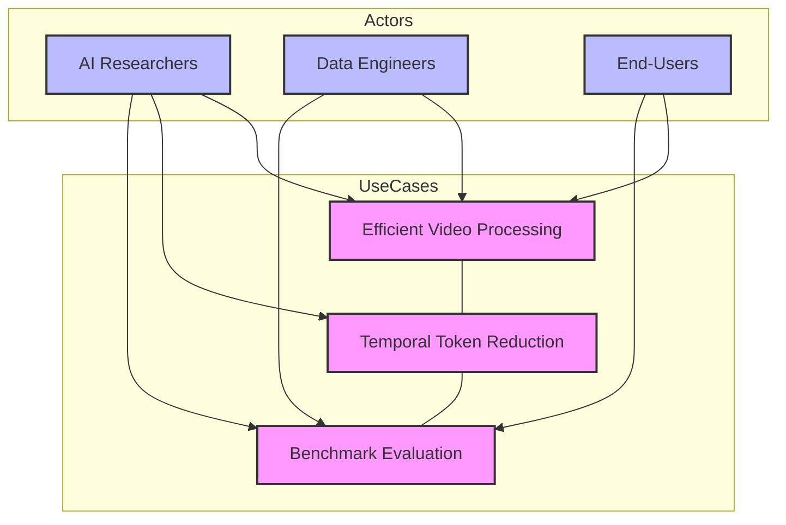

# STORM: Efficient Video Understanding with Token Reduction
### Discover how STORM uses spatiotemporal token reduction to enhance long-video AI processing, boosting efficiency and accuracy.

## Introduction

Video understanding is a critical component in modern AI applications, especially when processing long and dynamic sequences. Current video-language models tend to treat videos as mere sequences of static frames, which often leads to the loss of continuous motion details and causes computational inefficiencies. In this article, we introduce **STORM**—a novel approach that integrates spatiotemporal token reduction to address these challenges and substantially boost processing efficiency.

---

## Challenges in Video Processing

Traditional approaches in video processing encounter several obstacles:

- **Loss of Motion Details:** Frame subsampling often results in the omission of subtle but crucial motion information.
- **Computational Redundancy:** Overlapping frames lead to repetitive data, wasting computational resources.
- **High Processing Costs:** Longer videos drastically increase the computational burden and overall expenses.

Below is a diagram illustrating these challenges, emphasizing how static frame processing can miss essential motion details:


*Alt text: Diagram illustrating challenges in continuous video processing and missing motion details*

Transitioning from these challenges, the next section introduces how the STORM model overcomes them.

---

## Introducing the STORM Model

Developed collaboratively by researchers from NVIDIA, Rutgers University, UC Berkeley, MIT, Nanjing University, and KAIST, the **STORM model** is designed to directly integrate temporal information at the token level. Unlike conventional methods that treat temporal relations as secondary, STORM embeds temporal encoding into the model, thus reducing computational redundancy significantly. This allows the model to capture dynamic video content more effectively and efficiently.

Below is a visual summary that highlights the collaborative efforts and innovative framework behind STORM:


*Alt text: Visual summary of the STORM model introduction and research collaboration*

---

## Model Architecture and Technical Details

The STORM framework leverages innovative **Mamba layers** and is composed of several key modules:

- **Image Encoder:** Captures global spatial context from static images.
- **Mamba-Based Temporal Projector:** Employs a bidirectional scanning mechanism to integrate both spatial and temporal dynamics.
- **Temporal Encoder:** Acts as a spatial scanner for images and a spatiotemporal scanner for videos.
- **Token Compression Modules:** Use techniques like temporal pooling and training-free token subsampling to minimize redundant computations while preserving essential information.

During a two-stage training process, STORM initially undergoes an **alignment stage**—freezing the image encoder and language model while training only the temporal projector with image-text pairs. In the subsequent **supervised fine-tuning (SFT)** stage, the model is refined using a dataset of 12.5 million samples.

Below is a pseudo-code example that demonstrates the token reduction mechanism:

```python
# Pseudo-code for Spatiotemporal Token Reduction

def token_reduction(video_frames, pooling_ratio=0.5):
    """
    Reduce the tokens in a list of video frames by pooling them to preserve key temporal details.
    :param video_frames: List of tokens representing frames
    :param pooling_ratio: Fraction of tokens to retain
    :return: Compressed list of tokens
    """
    try:
        total_tokens = len(video_frames)
        retain_count = int(total_tokens * pooling_ratio)
        # Uniformly select indices based on the desired retention count
        indices = [int(i * total_tokens / retain_count) for i in range(retain_count)]
        reduced_tokens = [video_frames[i] for i in indices]
        return reduced_tokens
    except Exception as error:
        print('Error during token reduction:', error)
        return []

# Example Usage
if __name__ == '__main__':
    sample_frames = ['frame1', 'frame2', 'frame3', 'frame4', 'frame5', 'frame6']
    compressed_tokens = token_reduction(sample_frames, pooling_ratio=0.5)
    print('Compressed Tokens:', compressed_tokens)
```

*Reference: The diagram below further explains the training process and module configuration using Mamba layers and temporal encoders.*


*Alt text: Architecture diagram of training process using Mamba layers and temporal encoders*

---

## Experimental Evaluation and Results

The evaluation of STORM was conducted using long-video datasets such as EgoSchema, MVBench, MLVU, LongVideoBench, and VideoMME. The model, initially pre-trained with SigLIP models, integrates the temporal projector via random initialization and undergoes two main training stages (alignment and supervised fine-tuning).

The application of token compression via temporal and spatial pooling leads to a reduction in inference time by up to **65.5%**, while maintaining high accuracy. The following visuals highlight the performance benchmarks and detailed evaluation metrics:


*Alt text: Performance benchmark chart comparing STORM model with baseline approaches*


*Alt text: Detailed evaluation metrics showcasing improvements due to token reduction*

The experimental results clearly indicate the efficiency and robustness of the STORM model compared to traditional approaches.

---

## Conclusion

In summary, the **STORM model** represents a significant advancement in the field of video understanding. By directly incorporating spatiotemporal token reduction with innovative Mamba-based temporal encoding, STORM not only achieves state-of-the-art performance on long-video benchmarks but also drastically reduces computational requirements.

The integration of dynamic token compression techniques sets a new benchmark for efficiency in multimodal AI and paves the way for future research in dynamic video processing.


*Alt text: Conclusion visual summarizing the benefits and performance of the STORM model*

---

## FAQ

1. **What is the STORM model in video understanding?**  
   STORM is a novel approach that integrates spatiotemporal token reduction directly into video processing, reducing redundancy and improving efficiency.

2. **How does spatiotemporal token reduction improve video processing?**  
   By compressing tokens while preserving important temporal details, this method minimizes redundant computations and accelerates inference without compromising accuracy.

3. **What challenges does traditional video processing face?**  
   Traditional methods often lose motion details due to frame subsampling, suffer from computational redundancy, and incur high processing costs for long videos.

4. **How do Mamba layers contribute to the STORM model?**  
   Mamba layers enable a bidirectional scanning mechanism that effectively captures both spatial and temporal dynamics, enhancing the model's overall performance.

5. **What are the computational benefits of the STORM model?**  
   The model reduces inference time by up to 65.5% by efficiently compressing tokens, making it highly suitable for long-video processing.

---

## Diagrams

### Use Case Diagram for Efficient Video Processing with STORM



*Explanation: This diagram outlines the key actors and use cases involved in efficiently processing video data using the STORM model, clearly mapping interactions between researchers, engineers, and users.*

### System Architecture Diagram for Efficient Video Understanding using STORM

```mermaid
%% System Architecture Diagram for STORM
flowchart TD
    VI[Input Video Stream]
    IE[Pre-trained Image Encoder]
    TP[Mamba-based Temporal Projector]
    TE[Temporal Encoder (Spatial & Spatiotemporal Scanning)]
    TCP[Token Compression Modules (Temporal & Spatial Pooling)]
    LLM[Language Model (LLM)]
    GPU[GPU / Processing Unit]
    Out[Model Output & Benchmark Evaluation]

    VI --> IE
    IE --> TP
    TP --> TE
    TE --> TCP
    TCP --> LLM
    LLM --> Out

    %% Feedback loop for training and evaluation
    subgraph Training & Evaluation
       TE
       TCP
       LLM
    end

    GPU -.-> IE
    GPU -.-> TP
    GPU -.-> TE
    style IE fill:#cff,stroke:#333,stroke-width:2px
    style TP fill:#cff,stroke:#333,stroke-width:2px
    style TE fill:#cfc,stroke:#333,stroke-width:2px
    style TCP fill:#fcf,stroke:#333,stroke-width:2px
    style LLM fill:#ffc,stroke:#333,stroke-width:2px
    style GPU fill:#eee,stroke:#333,stroke-dasharray: 5 5
    style Out fill:#efe,stroke:#333,stroke-width:2px
```

*Explanation: This diagram visually maps the STORM model architecture, detailing the flow from video input through encoding, temporal processing, token compression, and final language model inference, supported by the GPU for efficient processing.*
