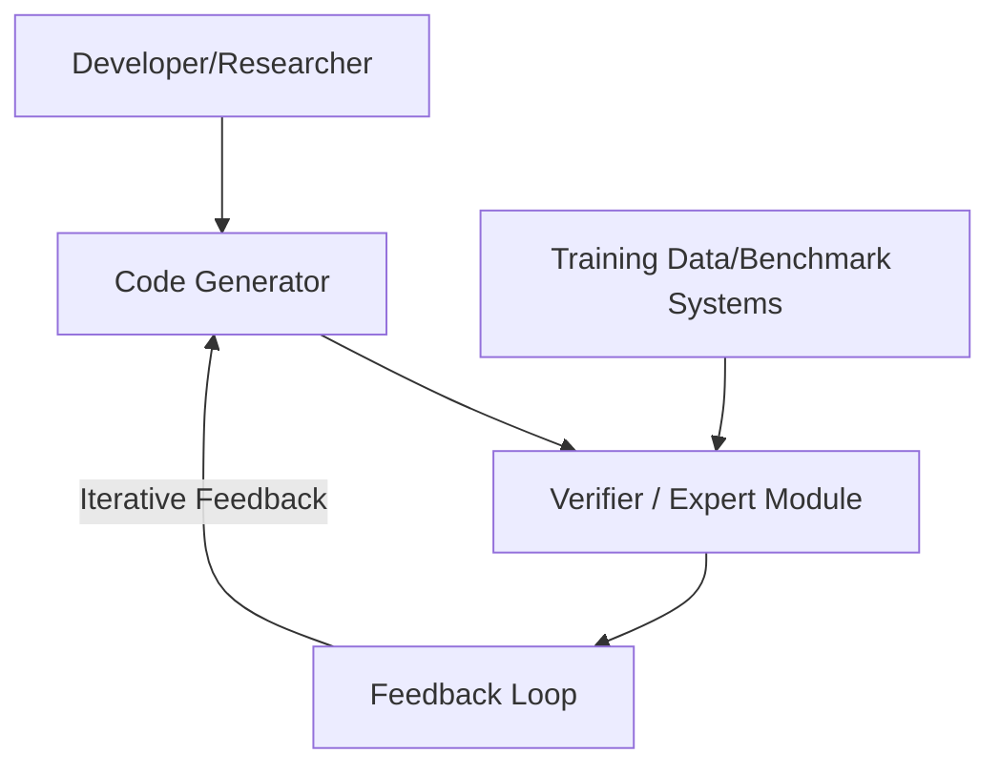

# µCODE: Multi-Turn Code Generation with Execution Feedback

<meta name="description" content="Explore µCODE, a scalable multi-turn code generation framework that leverages execution feedback for iterative improvements and precise coding.">

---

## Table of Contents
1. [Introduction](#introduction)
2. [Challenges in Code Generation](#challenges-in-code-generation)
3. [Related Work & Existing Methods](#related-work--existing-methods)
4. [The µCODE Framework](#the-%C2%B5code-framework)
    - [Pseudo-code Example](#pseudo-code-example)
5. [Diagrams](#diagrams)
    - [Use Case Diagram](#use-case-diagram)
    - [System Architecture Diagram](#system-architecture-diagram)
6. [Experimental Evaluation](#experimental-evaluation)
7. [Conclusion and Future Work](#conclusion-and-future-work)
8. [FAQ](#faq)
9. [References](#references)

---

## Introduction

Generating high-quality code through iterative execution feedback is a complex but essential challenge. Traditional methods often involve multiple re-generation cycles with limited error correction, leading to inefficiencies and instability. In this article, we introduce the innovative **µCODE framework**, which addresses these issues by combining multi-turn code generation with a learned verification mechanism. This framework not only refines outputs gradually but also ensures that each iteration brings the generated code closer to robustness and precision.

By integrating a learned verifier within an expert iteration framework, µCODE harnesses execution feedback—enabling iterative improvement, advanced error filtering, and precise code generation. This systematic approach offers compelling advantages over single-turn methodologies.

---

## Challenges in Code Generation

Automated code generation faces several key obstacles, particularly in handling iterative corrections and continuous improvement. Common challenges include:

- **Weak Learning Signals:** Inadequate feedback hampers effective training.
- **Ineffective Error Corrections:** Single-step techniques often require multiple reattempts.
- **High Computational Costs:** Methods, like Monte Carlo Tree Search (MCTS), incur significant processing overhead.
- **Simplistic Syntax Checks:** Basic syntax validations frequently overlook deeper logical errors.

These limitations highlight the need for a more robust framework that leverages in-depth execution feedback to facilitate progressive refinement of generated code.

---

## Related Work & Existing Methods

A variety of approaches have been explored to improve code generation performance:

- **Reward-based Models:** Systems such as CodeRL and ARCHER employ reinforcement learning to correct code errors, yet they tend to suffer from stability issues during prolonged iterations.
- **Verifier-based Approaches:** Techniques like "Let’s Verify Step by Step" and AlphaCode use test-case evaluations and syntax checks, but often lack a comprehensive, iterative refinement process.
- **Self-Debugging and Reflection-based Systems:** These methods provide incremental improvements, though they struggle with complex correction scenarios.

While each of these approaches offers valuable insights, they fall short in delivering continuous refinement and reliable performance compared to a multi-turn strategy like µCODE.

---

## The µCODE Framework

The µCODE framework introduces an iterative, multi-turn approach to code generation. Its architecture consists of several key components:

- **Code Generator:** Produces candidate code snippets based on the given problem prompt.
- **Local Search Expert:** Locally optimizes candidate solutions by leveraging immediate execution feedback.
- **Learned Verifier:** Utilizes supervised learning techniques (e.g., binary cross-entropy and Bradley-Terry ranking) to evaluate and score code quality.
- **Best-of-N Search Strategy:** At inference time, this strategy generates multiple candidate solutions and iteratively refines them until the verifier validates the quality of one candidate.

By formulating code generation as an imitation learning problem, µCODE eliminates the need for complex exploration strategies. This leads to streamlined processing, improved error filtering, and more robust code output.

### Pseudo-code Example

Below is a simplified pseudo-code snippet that demonstrates the iterative learning and feedback loop in the µCODE framework:

```javascript
// Pseudo-code illustrating the iterative feedback loop in µCODE
for (let iteration = 0; iteration < maxIterations; iteration++) {
    // Generate candidate code based on the current model
    let candidateCode = generateCode(problemPrompt);

    // Evaluate the generated candidate using the learned verifier
    let verificationScore = verifyCode(candidateCode);

    // If candidate meets the quality threshold, return the code
    if (verificationScore >= qualityThreshold) {
        return candidateCode;
    } else {
        // Update the code generator based on verification feedback
        updateGenerator(candidateCode, verificationScore);
    }
}
// If no candidate passes the threshold, return the best available candidate
return selectBestCandidate();
```

> **Note:** This pseudo-code outlines the iterative process where the generator produces code, the verifier evaluates it, and the generator is updated based on feedback until a satisfactory solution is obtained.

---

## Diagrams

Visual representations help clarify the internal operations of the µCODE framework. Below, we provide two diagrams using Mermaid syntax that illustrate the core components and interactions.

### Use Case Diagram



**Explanation:** This diagram demonstrates how the µCODE framework orchestrates interactive feedback. Developers initiate code generation, which is refined through continuous verification and iterative feedback until the final, high-quality code is achieved.

### System Architecture Diagram

```mermaid
flowchart TD
    A[Input Module<br/>(Problem Prompt)] --> B[Code Generator]
    B --> C[Local Search Expert]
    C --> D[Learned Verifier]
    D --> E[Best-of-N Search Mechanism]
    E --> F[Output Module<br/>(Final Code)]
    %% Feedback loop
    D -- Verification Score --> B
```

**Explanation:** This diagram illustrates the complete system architecture. It details the flow from the problem input, through candidate generation and local optimization, to verification, and finally the selection of the best solution. The feedback loop between the verifier and generator is crucial for iteratively improving code quality.

---

## Experimental Evaluation

The µCODE framework underwent extensive evaluation using industry-standard benchmarks such as MBPP and HumanEval. Key findings include:

- **Superior Performance:** Comparisons with single-turn approaches (e.g., STaR) and multi-turn baselines (Multi-STaR) show that µCODE consistently delivers higher quality code.
- **Advantages of Best-of-N Search:** Experiments demonstrated a 1.9% performance improvement on HumanEval using a 1B model, along with a 12.8% gain over greedy decoding strategies.
- **Effective Error Filtering:** The learned verifier significantly reduces the incidence of erroneous solutions, particularly in scenarios with limited public test cases.

These results provide strong evidence of the framework's effectiveness and superior scalability in tackling advanced code generation challenges.

---

## Conclusion and Future Work

The µCODE framework represents a significant advancement in multi-turn code generation by integrating a learned verification mechanism into an iterative expert framework. Its ability to refine candidate solutions continuously results in higher precision and more robust outputs compared to traditional single-turn methods.

**Key Takeaways:**
- Iterative execution feedback is critical for achieving high-quality code generation.
- The integration of a learned verifier streamlines error correction and optimizes candidate refinement.
- The Best-of-N search strategy further enhances performance by selecting the most promising code candidates.

**Future Directions:**
- **Scaling Up:** Adapting the framework to support larger models and more extensive datasets.
- **Broadening Scope:** Expanding to multiple programming languages and additional code generation tasks.
- **Deeper Benchmarks:** Incorporating more detailed performance metrics and real-world scenario evaluations.

Overall, µCODE lays a robust foundation for future exploration in iterative code generation and verification.

---

## FAQ

**Q: What is µCODE and how does it differ from single-turn code generation approaches?**  
**A:** µCODE is a multi-turn framework that iteratively refines generated code using execution feedback and a learned verifier. Unlike single-turn methods, it re-evaluates and incrementally improves candidates over several iterations.

**Q: How does execution feedback improve the accuracy of generated code?**  
**A:** Execution feedback provides real-time assessments of candidate code, allowing the framework to identify and correct errors through iterative refinement until the quality threshold is achieved.

**Q: What role does the learned verifier play in the µCODE framework?**  
**A:** The learned verifier evaluates each generated code snippet using supervised learning techniques. It acts as a quality gate, ensuring that only candidates meeting the predefined standards are accepted or further refined.

**Q: Which benchmarks are used to evaluate multi-turn code generation methods?**  
**A:** µCODE is evaluated using established benchmarks such as MBPP and HumanEval, which offer standardized test cases and metrics to measure code generation performance.

---

## References

- [MBPP Benchmark](https://example.com/mbpp)
- [HumanEval Benchmark](https://example.com/humaneval)
- [Related Work on CodeRL and ARCHER](https://example.com/research)

---

> **Important:** This article provides a comprehensive overview of the µCODE framework with technical depth and clear visual aids to empower researchers and developers in advancing iterative code generation techniques. Enjoy exploring this innovative approach to automated code generation!